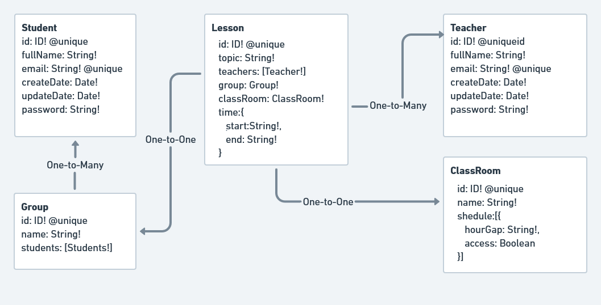

# School for Chatbots.Studio

School API endpoints:

GET /api/lessons/

GET /api/lessons/:id

POST /api/lessons/

PUT /api/lessons/:id

DELETE /api/lessons/:id

Postman_collection:

DB sample

Extended Schema of DB (used more simple variant)

